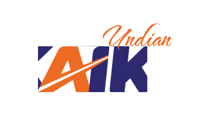

# Undian KAI Web App
<div align="center">
  
</div>

Undian KAI Web App developed using Next.js to manage lottery and winner history for PT KAI. You can view the deployed app [here](https://undian.likluk.live).

```
NIPP: 13510
Password: adminpusat
```

## Table of Contents
* [Preview Video On YouTube](#preview-video-on-youtube)
* [Technologies Used](#technologies-used)
* [Features](#features)
* [Setup](#setup)
* [Project Status](#project-status)
* [Authors](#authors)

## Preview Video On YouTube
[](https://www.youtube.com/watch?v=D-iCArJ_FA8)

## Technologies Used
       


## Features
- Add events includes prize and date
- Lottery draw
- View winners history

## Setup Locally
1. Clone this repository
2. Install dependencies using `npm install`
3. Set up the environment variables for database and JWT authentication in `.env`. Use `.env.example` as a reference.
4. Initialize the Prisma database: `npx prisma migrate dev`
5. Add username and password to the database: `npx prisma studio`
6. Run the project locally: `npm run dev`
7. Open `http://localhost:3000` to view it in the browser.

## Project Status
The project is under active development. You can contribute to this project by creating a pull request.

## Authors
- [Muhamad Salman Hakim Alfarisi](https://github.com/archmans)
- [M. Malik I. Baharsyah](https://github.com/malikbaharsyah)